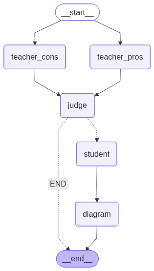

## Grand oral topic selection
The aim of this project is to evaluate if one topic is relevant for the french baccalaureat grand oral
It is based on the following technologies:
- Langgraph for agentic AI
- Gradio for UI

The agent graph is composed with the following agents:
- Agents in charge of evaluating if a topic is relevant (pros, cons, and a judge)
- Agent in charge of building the plan (student)
- Agent in charge of generating images to illustrate the grand oral

